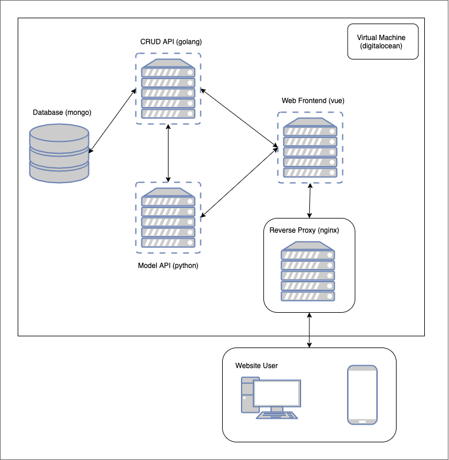

# My Sproj 🤓
Bard Senior Project 2019-2020

## Where Stuff Is Deployed 🚀

- Frontend - https://sproj.colehollant.com
- Backend - https://sproj.api.colehollant.com
- Model - https://sproj.api.colehollant.com
- Survey - https://spaces.colehollant.com/thesis-survey/index.html

## Running ⛹️‍♀️

There's a whole lot going on, unfortunately. Most things are within `/thesaurus` as we are simply not interested in renaming anything. The key bits are `/thesaurus/backend`, `/thesaurus/model`, `/thesaurus/frontend`, and I suppose `/thesaurus/webscrape` (again, largely bad names, but oh well). For convenience sake, we have `/thesaurus/app.sh` to control image building/running, although it's just a lazier way to use `docker-compose`, and you can ignore it in favor of standard commands.

Some sample server blocks are within `/thesaurus/nginxSamples`, as a pointer for setting things up yourself. If you _are_ setting this up yourself, you can populate the database with the script `/thesaurus/webscrape/postentries.py`. If you need to target local endpoints within the frontend `yarn dev` will set the `NODE_ENV` to `dev` which should force localhost.

Everything is on a VM, and everything is ran through docker-compose, just need the appropriate environment variables to actually run things. These environment variables are:

```sh
DBHOST # within /thesaurus/backend/.env
MONGOPORT # within /thesaurus/backend/.env
MONGO_USERNAME # within /thesaurus/backend/.env
MONGO_PASSWORD # within /thesaurus/backend/.env
MONGO_INITDB_ROOT_USERNAME # within /thesaurus/.env
MONGO_INITDB_ROOT_PASSWORD # within /thesaurus/.env
```

I know I'm supposed to have some script to make a db admin and use that, but I haven't done that here 🤷🏼‍♀️ (it's all populated from a script anyways)—something something something left as an exercise to the reader. Outside of that, you can always run things sans-docker if you want! For that, it should all be standard.

```sh
/thesaurus/backend:$ go run main.go 
/thesaurus/model:$ python3 -B -m model
/thesaurus/frontend:$ yarn dev # or yarn serve
```

If you've gotta train a model, should be able to `python3 -m lda -t`. Then I guess move the files it writes to `/thesaurus/model/model/ldamodel*`

## Architecture 🏗



Again, everything is on a vm, and everything is in containers. You should be pretty free to plop this wherever you can use containers! I personally used some Ubuntu droplet on Digital Ocean, `sudo apt got` everything I needed, and called it a day. We had some security issues earlier (lol db got ransom-ed before we set up any auth), but ultimately everything is pretty low stakes.